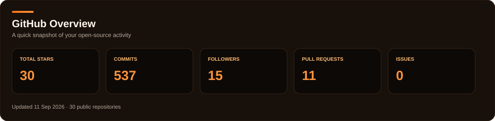
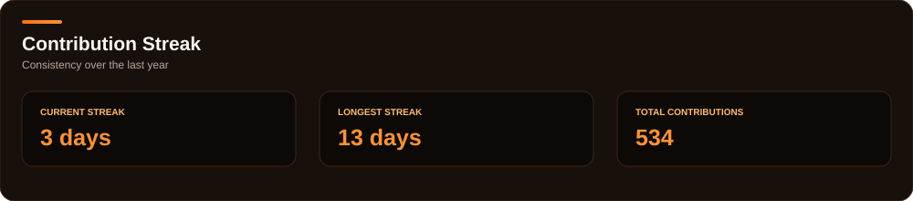
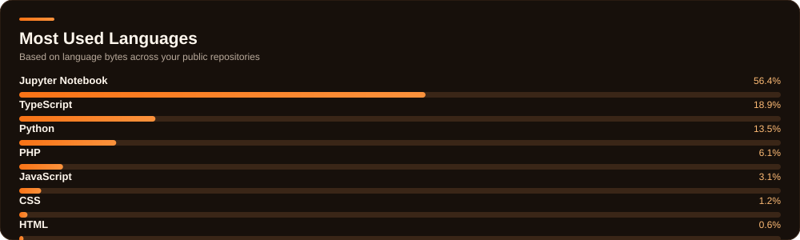
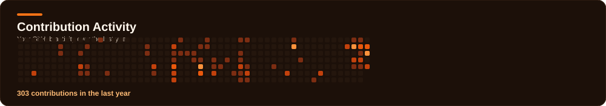

<div align="center">


<a href="https://prathmeshhchavan.vercel.app/"></a>
<a href="https://www.linkedin.com/in/prathmesh-chavan-055556378/"></a>
<a href="mailto:prathmeshc002@gmail.com"></a>

<br/><br/>


</div>

---

## About Me

I'm a **Software Engineer and AI/ML enthusiast** focused on building practical products. I enjoy working across machine learning, backend systems, modern frontends, and cloud deployment.

```yaml
focus:
  - Artificial Intelligence
  - Machine Learning
  - Full-Stack Development
  - LLM Applications
philosophy: "Build. Break. Fix. Learn. Repeat."
```

### Open To


---

## 🛠️ Tech Stack

**Languages:** Python · JavaScript · TypeScript · C++ · HTML · CSS

**Frontend:** React · Next.js · Redux · Tailwind · Vite · Flutter

**Backend:** Node.js · Flask · FastAPI · MongoDB · PostgreSQL · Redis · Firebase

**AI / ML:** PyTorch · TensorFlow · scikit-learn · NumPy · Pandas

**Cloud & DevOps:** AWS · GCP · Azure · Docker · Kubernetes · Vercel · GitHub Actions · Postman

---

## 🤖 AI / ML Expertise

| Domain | Level |
|:--|:--:|
| Machine Learning Fundamentals | ⭐⭐⭐⭐☆ |
| Deep Learning | ⭐⭐⭐⭐☆ |
| Natural Language Processing | ⭐⭐⭐☆☆ |
| Data Engineering & Analysis | ⭐⭐⭐⭐☆ |
| MLOps & Deployment | ⭐⭐⭐☆☆ |
| Applied AI Projects | ⭐⭐⭐⭐☆ |

---

## 🚀 Featured Projects

### AI-Powered Content Assistant
End-to-end AI application for analyzing, summarizing, and generating content.

**Stack:** Python · FastAPI · React · PyTorch · MongoDB

### Real-Time Data Analytics Dashboard
Real-time visualization platform using live data streams and interactive dashboards.

**Stack:** React · Flask · WebSockets · Plotly · Firebase

---

## 💻 Coding Profiles

<div align="center">

[](https://leetcode.com/prathamc00)
[](https://www.geeksforgeeks.org/user/prathamc00)
[](https://www.hackerrank.com/prathamc00)
[](https://www.codechef.com/users/prathamc00)

</div>

---

## 📊 GitHub Analytics

<div align="center">

<table>
<tr>
<td width="52%" valign="top" align="center">



<br/><br/>



</td>
<td width="48%" valign="top" align="center">



</td>
</tr>
</table>

<br/>



<br/><br/>


</div>

---

## 🐍 Contribution Snake

<div align="center">


</div>

---

## 🏆 Certifications


---

## 🔗 Connect With Me

<div align="center">

[](https://prathmeshhchavan.vercel.app/)
[](https://www.linkedin.com/in/prathmesh-chavan-055556378/)
[](https://github.com/prathamc00)
[](mailto:prathmeshc002@gmail.com)

</div>

---

<div align="center">

*"Code is the closest thing we have to magic — I'm just here to keep casting spells."*


</div>